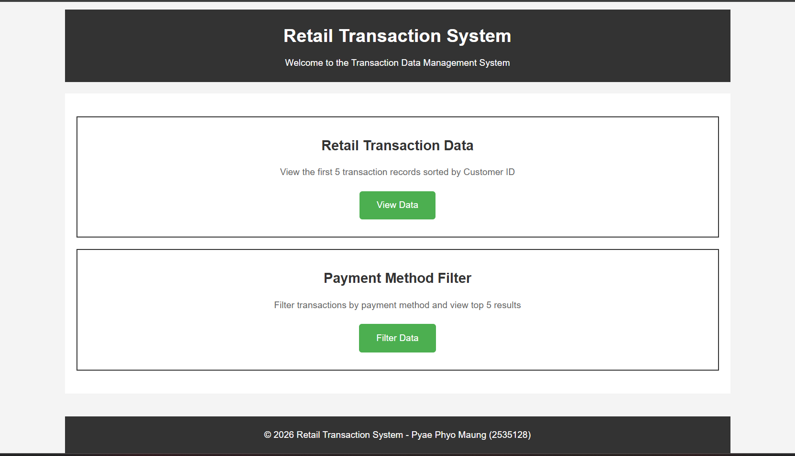
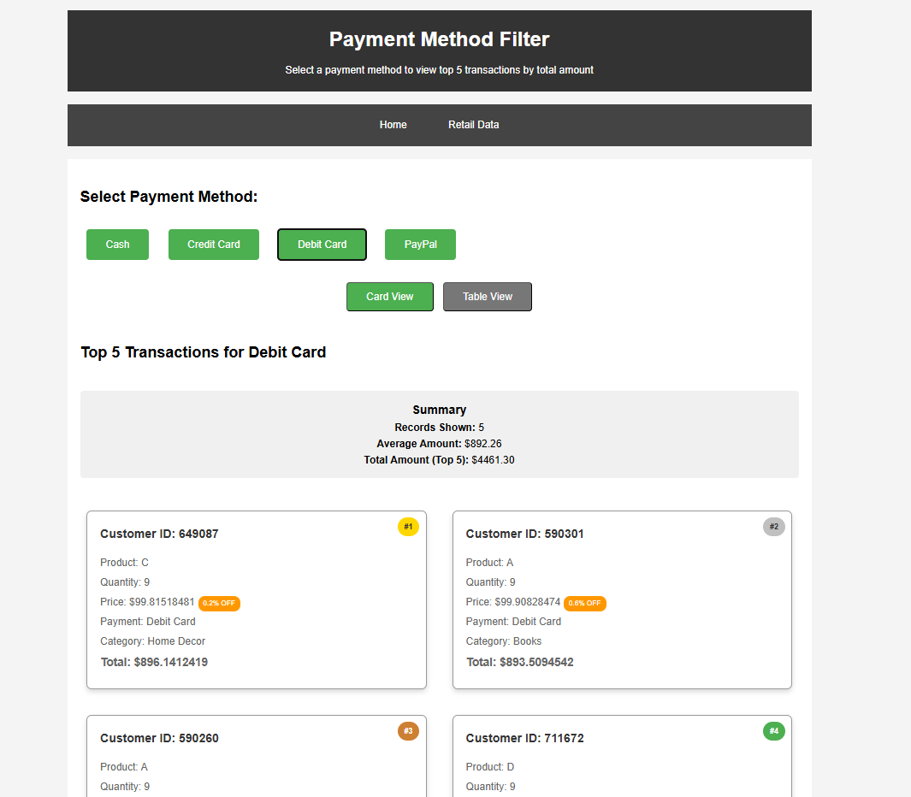
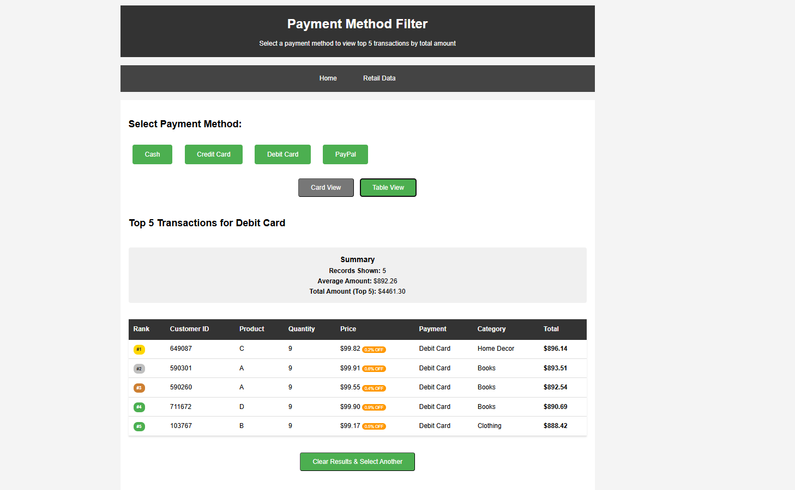
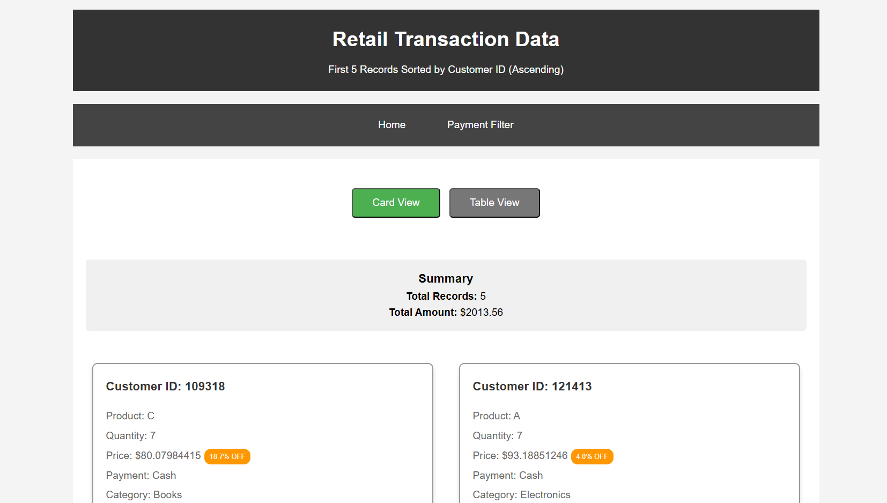
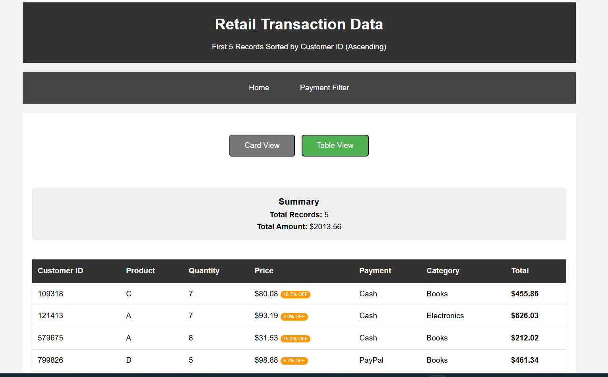

# Retail Transaction System

## Project Summary
This is a Retail Transaction System. I built a simple Node.js server that reads retail sales data from a CSV file and turns it into API output for filtering and reporting.

What it does:
- loads sales data from `data/retailTransaction.csv`
- converts CSV rows into JSON transaction objects
- supports filters by payment method and product category
- gives quick API routes for the frontend to use

## Main files and what they do

### `server.js`
The main app file.
- uses `express`, `fs`, `csv-parse`, and `cors`
- reads `data/retailTransaction.csv` when the server starts
- converts each row into a JSON object
- groups transactions by payment method and product category
- exposes REST endpoints for the frontend or browser

### `package.json`
Project info and dependencies.
- includes packages like `express`, `csv-parse`, and `cors`
- lets you install everything with `npm install`

### `data/retailTransaction.csv`
The data file with retail sales records.
- is in CSV format
- includes fields like customer ID, product ID, payment method, category, price, and total amount

## How it works
1. Server starts and reads the CSV file using `fs.createReadStream()`.
2. `csv-parse` parses each row into an object.
3. All transaction objects are stored in memory.
4. The app builds lookup groups for payment methods and product categories.
5. Server runs on `localhost:8081` and responds to API calls.

## API endpoints
Use these routes to get transaction data:
- `GET /` — basic health check
- `GET /retailData5` — first 5 transactions
- `GET /byPaymentMethod/:paymentMethod` — transactions by payment method
- `GET /byProductCategory/:productCategory` — transactions by category
- `GET /productCategory` — list of available categories
- `GET /paymentMethod` — list of available payment methods

## How to run the project
From the project root run:
```bash
npm install
node server.js
```
Then open `http://localhost:8081` in a browser or use the API routes.

## What I learned
This project helped me practise reading CSV data in Node.js, building simple REST APIs, and connecting backend data with a frontend app. It was a good exercise for understanding basic server logic and filtering data in a real project.











